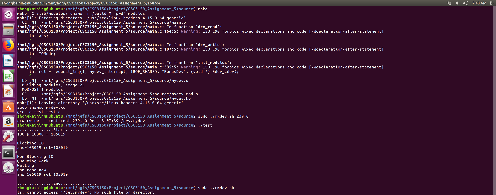
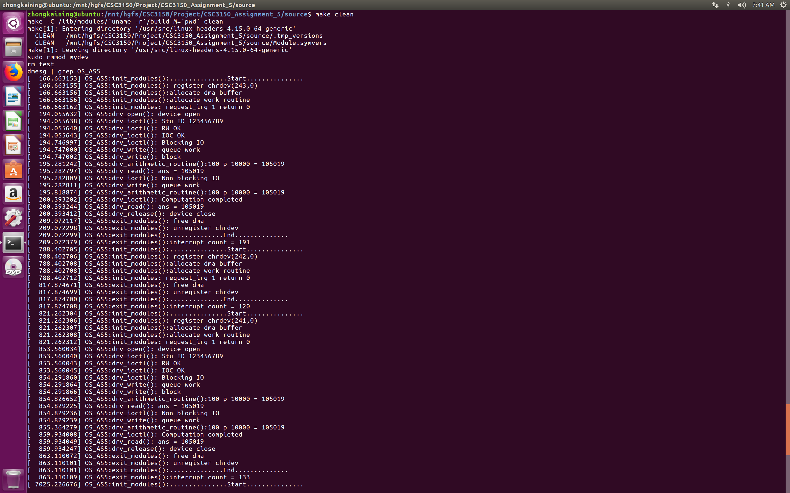
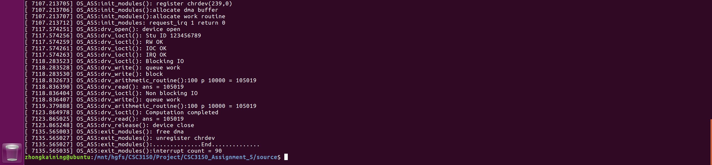

# CSC3150 Project 5 Report

## 1. How did you design your program?
### Between user program and kernel program
- User program maps its instructions that perform to files (devices regarded as files in Linux) to the kernel program via the following struct:
```C
// cdev file_operations
static struct file_operations fops = {
      owner: THIS_MODULE,
      read: drv_read,
      write: drv_write,
      unlocked_ioctl: drv_ioctl,
      open: drv_open,
      release: drv_release,
};
```

Then, in kernel program, as the mapped functions are invoked, they assign macros defined ioc_hw5.h to the DMA buffer (seen as the actual device in our project). There macros are listed below:

| Macro           | Value | Meaning                           |
| --------------- | ----- | --------------------------------- |
| DMA_BUFSIZE     | 64    | Size of DMA buffer                |
| DMASTUIDADDR    | 0x0   | Student ID                        |
| DMARWOKADDR     | 0x4   | RW function complete              |
| DMAIOCOKADDR    | 0x8   | ioctl function complete           |
| DMAIRQOKADDR    | 0xc   | ISR function complete             |
| DMACOUNTADDR    | 0x10  | interrupt count function complete |
| DMAANSADDR      | 0x14  | Computation answer                |
| DMAREADABLEADDR | 0x18  | READABLE variable for synchronize |
| DMABLOCKADDR    | 0x1c  | Blocking or non-blocking IO       |
| DMAOPCODEADDR   | 0x20  | data.a opcode                     |
| DMAOPERANDBADDR | 0x21  | data.b operand1                   |
| DMAOPERANDCADDR | 0x25  | data.c operand2                   |

Then, to control the device, we only need to change these attributes in the DMA buffer.

Next, we implemented the device funcions:

- drv_open
To open a file (device), just simply call function 	try_module_get(THIS_MODULE)

- drv_release
Similarly, to release a flie (device), call function module_put(THIS_MODULE)

- drv_read
To read a content in DMA buffer, you need to first check whether it is OK to read, if not, then wait until it is OK:
```C
while (myini(DMAREADABLEADDR) != 1){
        msleep(5000);
}
```
As it is OK to read, use myini function to extract data from DMA buffer and use function put_user to pass the result to user program

- drv_write
To write contents into DMA buffer, first put the parameter data into DMA buffer (a, b, c) via get_user function. Then, check the DMABLOCKADDR macro in DMA buffer to determine its IO mode, as well as init a work.

If block write, then apart from schedule_work(work), you also need to flush_scheduled_work to block all other tasks that to be performed by CPU.

If non-block write, schedule the work without flush other work.

After the work is done, use myouti to set DMARWOKADDR as 1, to denote that it is OK to write or read again

- drv_ioctl
Set the value of macros using myouti function according to cmd:
```C
if (cmd == HW5_IOCSETSTUID){
  // Set student ID: printk your student ID
      myouti(value, DMASTUIDADDR);
      printk("%s:%s(): Stu ID %d", PREFIX_TITLE, __func__, value);
  }

else if (cmd == HW5_IOCSETRWOK){
  // Set if RW OK: printk OK if you complete R/W function
      myouti(value, DMARWOKADDR);
      printk("%s:%s(): RW OK\n", PREFIX_TITLE, __func__);
}

else if (cmd == HW5_IOCSETIOCOK){
  // Set if ioctl OK: printk OK if you complete ioctl function
      myouti(value, DMAIOCOKADDR);
      printk("%s:%s(): IOC OK\n", PREFIX_TITLE, __func__);
}

else if (cmd == HW5_IOCSETIRQOK){
  // Set if IRQ OK: printk OK if you complete bonus
      myouti(value, DMAIRQOKADDR
      printk("%s:%s(): IRQ OK\n", PREFIX_TITLE, __func__);
}

else if (cmd == HW5_IOCSETBLOCK){
  // Set blocking or non-blocking: set write function mode
      if (value == 1) printk("%s:%s(): Blocking IO\n", PREFIX_TITLE, __func__);
      else printk("%s:%s(): Non blocking IO\n", PREFIX_TITLE, __func__);
      myouti(value, DMABLOCKADDR);
}

else if (cmd == HW5_IOCWAITREADABLE){
  // Wait if readable now (synchronize function)
    while (myini(DMAREADABLEADDR) == 0){
//            printk("%s:%s(): Not readable yet", PREFIX_TITLE, __func__);
          msleep(5000);
    }
      printk("%s:%s(): Computation completed\n", PREFIX_TITLE, __func__);
      put_user(1, (int *) arg);
}
```
Note, when HW5_IOCWAITREADABLE cmd, we wait until the compution ends, so we can return 1 to indicate tht now it is readable.

- drv_arithmetic_routine
Do exactly the same arithmetic operation as the one in user program, and use myouti to output the results into DMA buffer.


## 2. What problems you met in this assignment and what is your solution?
As I was writing the bonus problem, I found that there is not much help in the tutorial slides, so I went to google for help. Luckily, there are examples on CSDN, so I found the correct solution. The major problem turns out to be I accidently set the name for the module 'mydevice' instead of "mydevice", which is supposed to be character array. Thus, every time I make in Linux, the kernel crashes. I realized my misspelling after a few times, and corrected it afterwards.

## 3. The steps to execute your program.
```bash
make
dmesg | tail -n 20 ## remember the major & minor number
sudo chmod +x ./mkdev.sh
sudo ./mkdev.sh major_num minor_num
gcc test.c -o test
./test
sudo chmod +x ./rmdev.sh
sudo ./rmdev.sh
make clean
```

## 4. Screenshot of your program output.





## 5. What did you learn from this assignment?
I learned how a device is attached to the Linux OS, and how to control it via user problem by inserting a kernel module as the device driver
